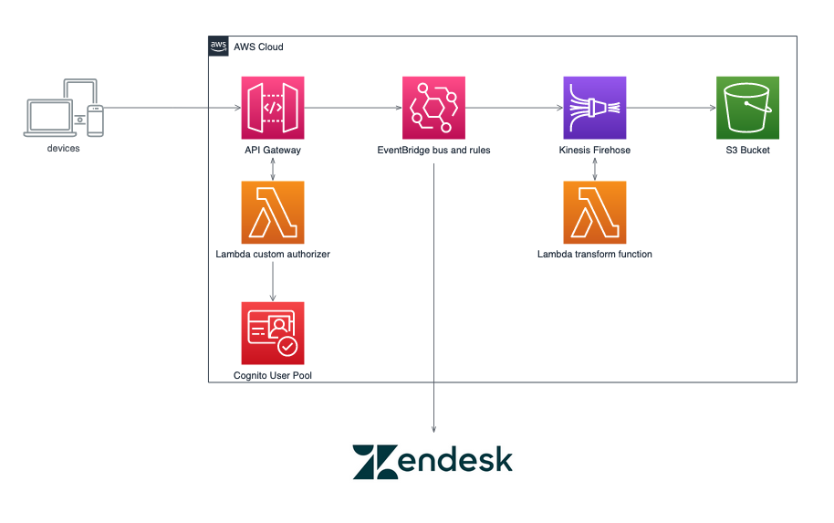
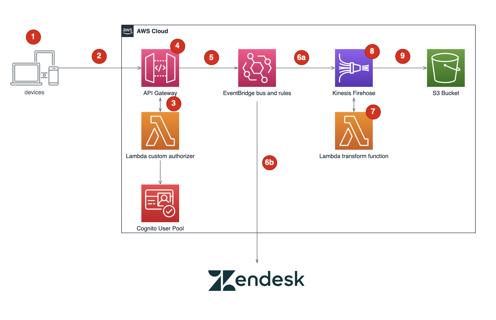

# Client event capture using EventBridge

## Overview

 

This project contains source code and supporting files for a serverless application that you can deploy with the SAM CLI. It includes the following files and folders.

- functions - Code for the application's Lambda functions, which are:
  - A Cognito post-signup function, to generate the unique clientId for each set of credentials
  - A custom Lambda authorizer for API Gateway that validates a JWT and returns a mapped clientId
  - A Kinesis Firehose transformation function, to modify the record before writing it to S3
- utils - a Python-based event generator which sends events through API Gateway
- events - a sample event that can be used to model your events from
- template.yaml - A template that defines the application's AWS resources.

This application captures client events, supporting both near real-time and batch deliveries via an HTTPS endpoint supported by API Gateway. API Gateway invoked a custom Lambda authorizer function, which provides a custom clientId back to API Gateway. API Gateway then transforms the incoming set of events into EventBridge events, including the custom ClientID as the event's resource. These events are then processed by a rule which forward the events to Kinesis Firehose delivery stream.

The Kinesis Firehose delivery stream transforms the records to a format that will be used by analytics, and stores it in an S3 bucket. Kinesis Firehose also supports dynamic partitioning, based on data in the messages, to deliver the messages to a prefixed location without the need for multiple Kinesis Firehose delivery systems.

The application uses several AWS resources, including an API Gateway instance, Lambda functions, and an EventBridge Rule trigger. These resources are defined in the `template.yaml` file in this project. You can update the template to add AWS resources through the same deployment process that updates your application code.

## Pre-requisites for deploying this application
* [SAM CLI](https://docs.aws.amazon.com/serverless-application-model/latest/developerguide/serverless-sam-cli-install.html)
* [Python 3](https://www.python.org/downloads/)
* [Docker](https://hub.docker.com/search/?type=edition&offering=community)
* [AWS CLI](https://docs.aws.amazon.com/cli/latest/userguide/getting-started-install.html)
* [Zendesk Demo Account](https://www.zendesk.com/)
* [Zendesk API tokey for your demo account](https://support.zendesk.com/hc/en-us/articles/4408889192858-Generating-a-new-API-token)
* [API Gateway IAM Role with Logging Permissions](https://docs.aws.amazon.com/apigateway/latest/developerguide/set-up-logging.html)

*Note:* This solution uses basic authentication with Zendesk in free mode. Zendesk offers OAuth and API Key authentication modes in addtion to basic authentication. We strongly encourage the use of an appropriate authentication solution for your implementation.

## Deploy this application

The Serverless Application Model Command Line Interface (SAM CLI) is an extension of the AWS CLI that adds functionality for building and testing Lambda applications. It uses Docker to run your functions in an Amazon Linux environment that matches Lambda.

Before building and deploying this application, you will need to create two secrets in AWS Secrets Manager to store your username and password for Zendesk. From the command line, use the following commands in your shell to create these secrets, replacing the placeholders with appropriate values:

```bash
aws secretsmanager create-secret --name proto/Zendesk --secret-string '{"username":"<YOUR EMAIL>","apiToken":"<YOUR ZENDESK API TOKEN>"}'
```

After the secrets are creeated, build the application running the below command in your shell:

```bash
sam build --use-container
```

The second command will package and deploy your application to AWS, with a series of prompts:

To deploy this application, run the following in your shell:

```bash
sam deploy --guided --capabilities CAPABILITY_NAMED_IAM
```

---
**NOTE**
SAM deploy for this project needs `CAPABILITY_NAMED_IAM` as the template creates roles and policies.
---

* **Stack Name**: The name of the stack to deploy to CloudFormation. This should be unique to your account and region, and a good starting point would be something matching your project name. `clientevents` is recommended.
* **AWS Region**: The AWS region you want to deploy your app to.
* **ZendeskEndpoint**: The endpoint for your Zendesk instance, in the form of `https://#####.zendesk.com/api/v2/tickets` where `#####` is your Zendesk domain.
* **Confirm changes before deploy**: If set to yes, any change sets will be shown to you before execution for manual review. If set to no, the AWS SAM CLI will automatically deploy application changes. Answer 'Y' to this.
* **Allow SAM CLI IAM role creation**: Many AWS SAM templates, including this example, create AWS IAM roles required for the AWS Lambda function(s) included to access AWS services. By default, these are scoped down to minimum required permissions. To deploy an AWS CloudFormation stack which creates or modifies IAM roles, the `CAPABILITY_IAM` value for `capabilities` must be provided. If permission isn't provided through this prompt, to deploy this example you must explicitly pass `--capabilities CAPABILITY_NAMED_IAM` to the `sam deploy` command. Answer 'Y' to this.
* **Save arguments to samconfig.toml**: If set to yes, your choices will be saved to a configuration file inside the project, so that in the future you can just re-run `sam deploy` without parameters to deploy changes to your application.

## Event Flow

 

1. Event entries are captured via the client application. These events can be batched together or individual events.
2. The entries are sent to API Gateway, with a JWT as an Authorization header that will be used to validate the client.
3. The Lambda custom authorizer decodes the JWT, identifies the user, looks up a custom value called `custom:clientId` in Cognito and returns this data as part of the authorization `context` variable.
4. API Gateway will then enrich the event entries to include the `environment` and `event_bus_name`, which are stored as stage variables on the API Gateway stage, and the `custom:clientId` returned from the Lambda custom authorizer.
5. The events are then sent to EventBridge using API Gateway's service integration
6. EventBridge then evaluates rules on the client events bus to route requests
    a. Any event with the source `clientevents` is routed to Kinesis Firehose
    b. Events containing the source `clientevents` and detail.eventType of `loyaltypurchase` are sent to Zendesk using an EventBridge API Destination
7. Events sent to Kinesis Firehose are sent to a Lambda function for transformation. This activity shows how you can transform the event before storing it and can be made optional.
8. Kinesis Firehose then deaggragates all the records forwarded to it, and stores the records on S3 using the keys `eventType`/`schemaVersion`

## Capturing client events using the event generator

1. Set environment variables to assist with simplifying the operations

Set the following environment variables in your shell, replacing the placeholder values with the outputs from the `sam deploy --guided` step above.
```bash
APIID=<API Gateway ID>
APPCLIENTID=<Application Client ID>
BUCKET=<S3 Bucket for EventBridge Events>
```

Set an environment varialbe for the region you have deployed the solution to, such as `us-east-1`
```bash
REGION=<Region>
```

2. Create a user

Create a user by using the below command, replacing the placeholders for userid, password and email.

```bash
aws cognito-idp sign-up --client-id $APPCLIENTID --username <userid> --password <password> --user-attributes Name=email,Value=<EMAIL>
```

Password values must be at least 8 characters long, have an uppercase letter, lowercase letter, and symbol. Cognito will generate a code to verify the user and send it to the email you use. It is important to use and email address that you have access to for this step.

3. Check your email and confirm the user

Retrieve the code that was sent to the email you used in step 2 and verify the user you created using the following command, replacing the placeholders.

```bash
aws cognito-idp confirm-sign-up --client-id $APPCLIENTID --username <userid> --confirmation-code <confirmation code>
```

You can validate the confirmation worked by triggering a sign-in using the commmand, which will return a JWT if it is successful:

```bash
aws cognito-idp initiate-auth --auth-flow USER_PASSWORD_AUTH --client-id $APPCLIENTID --auth-parameters USERNAME=<userid>,PASSWORD=<password> | jq '.AuthenticationResult.AccessToken' -r
```

4. Generate test events using the included Python-based generator

The Python-based generator is meant to simulate a user using a mobile or web client to access your application. It sends batches of up to 10 events every 10 seconds for a length of time defined at runtime.  Use the sample commands below, replacing the placeholders

```bash
cd utils
python3 generator.py --minutes <minutes to run generator> --batch <batch size from 1-10> --loyalty <True|False> --userid <userid> --password <password> --region $REGION --appclientid $APPCLIENTID --apiid $APIID
```

Note: The generator utility requires boto3 and argparse external dependencies to function. If these are not installed on your local environment, you may need to create a virtual environment in this directory and then install the dependecies before running the utility. To do so, use the following commands from the utils directory.

```bash
python3 -m venv .venv
. .venv/bin/activate
pip3 install -r requirements.txt
```

5. Evaluate data stored in S3 bucket

Copy the contents of the S3 events bucket to a local temporary location, such as ./data, to peruse the records stored in S3. Make sure to change directory to your temporary directory before running this command.

```bash
mkdir data
cd data
aws s3 sync s3://$BUCKET .
```

## Cleanup

If you have generated any events either via the provided generator or directly, you will need to empty the S3 buckets that are created in this stack before deleting the entire stack. If you do not, your buckets and the data stored in them will not be deleted.

Additionally, delete the Secrets Manager secret using the following command:
`aws secretsmanager delete-secret --secret-id <arn of secret>`

To delete the sample application that you created, use the AWS CLI. Assuming you used your project name for the stack name, you can run the following:

```bash
aws cloudformation delete-stack --stack-name eb_client_events
```

## Resources

See the [AWS SAM developer guide](https://docs.aws.amazon.com/serverless-application-model/latest/developerguide/what-is-sam.html) for an introduction to SAM specification, the SAM CLI, and serverless application concepts.

Next, you can use AWS Serverless Application Repository to deploy ready to use Apps that go beyond hello world samples and learn how authors developed their applications: [AWS Serverless Application Repository main page](https://aws.amazon.com/serverless/serverlessrepo/)
